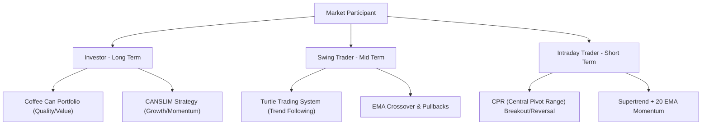

# Successful Investing and Trading Strategies for Indian & Commodity Markets

This guide outlines prominent investing and trading strategies used by successful
market participants worldwide, adapted for the Indian equity (NSE/BSE) and
commodity (MCX) markets. Each is implemented as a tab in this screener.

---

## 1. The Coffee Can Portfolio (Long-Term Value & Quality)
*Popularised in India by Saurabh Mukherjea (Marcellus).* Buy ultra-high-quality,
moated companies and hold for ~10 years. Filters:
- **Forensic accounting** — clean governance, sane debt.
- **ROCE > 15% every year for 10 years** (non-financials); **ROE > 15%** + CAR > 15% for banks/NBFCs.
- **Revenue growth > 10% every year for 10 years.**
- **Exit only** if the moat is permanently broken. Target: 15–20% CAGR compounding.
- Examples: Asian Paints, Pidilite, HDFC Bank, TCS, Titan.

## 2. CANSLIM (Medium-Term Growth/Momentum)
*William J. O'Neil.* Techno-fundamental:
- **C/A** — current quarterly EPS growth > 20–25% YoY; annual EPS growth > 25% over 3 yrs.
- **L** — Relative Strength rating > 80.
- **N** — breakout from a healthy base (cup-and-handle, flat base) to new 52-week/all-time high.
- **S** — breakout volume ≥ 40–50% above the 50-day average.
- **Exit** — hard stop 7–8% below entry; book at +20–25%; trail strong names on the 50-EMA.

## 3. Turtle Trading System (Medium-Term Trend Following)
*Richard Dennis / William Eckhardt. Excellent for MCX commodities.*
- **System 1** — buy 20-day high / short 20-day low (skip if last breakout was profitable).
- **System 2** — buy 55-day high / short 55-day low (always take).
- **Exits** — Sys-1: 10-day reverse extreme; Sys-2: 20-day reverse extreme.
- **N = ATR(20).** Unit size = (equity × 1%) / (N × lot value). **Hard stop = 2N.**
- **Pyramiding** — add a unit every +0.5N, max 4 units.

## 4. Supertrend + 20 EMA Momentum (Intraday & Swing)
*Retail MCX (Crude, Natural Gas) and high-beta equities.*
- 20-EMA trend filter + Supertrend(10,3) volatility flip. Buy: price **above** 20-EMA and
  Supertrend turns **green**; sell: below 20-EMA and Supertrend **red**.
- Timeframes: 5/15-min intraday, 1-hr/daily swing. SL behind the Supertrend line; target 1:2 or trail.

## 5. Central Pivot Range (CPR) — Intraday Index
From the previous session's H/L/C:
- **P = (H+L+C)/3**, **BC = (H+L)/2**, **TC = P + (P − BC)**.
- **Narrow CPR** → trending day (trade breakouts); **wide CPR** → range day (fade edges).
- Narrow breakout long: close above TC / PDH → SL below BC → target R1/R2.
- Wide reversion long: bullish pattern at the CPR zone → SL below BC → target PDH/R1.

## 6. Stock Swing Setups (Days–Weeks)
- **A. 20-EMA Pullback** — uptrend (20 > 50 > 200 EMA), pull back to rising 20-EMA + bullish
  reversal bar; SL below trigger low / 50-EMA; target 1:2.
- **B. Bollinger Squeeze** — band-width at a 15–20 session low, close above the upper band on
  ≥ 1.5× volume; SL at the 20-SMA; target 1:2–1:3.
- **C. High-RS Consolidation** — Nifty soft while an RS leader holds above its 20/50-EMA, then
  breaks its range on volume; SL ~1% below the range; target +15–25% or trail the 20-EMA.

## 7. MCX commodity notes
Global alignment (COMEX/NYMEX/LME), USD/INR catalyst, best trends in the 6:00–11:30 PM IST
US-overlap session, and news gaps around OPEC+/EIA inventory (Crude Wed 8 PM, Nat-Gas Thu 8 PM IST) —
exit/hedge before releases.

---

### Strategy comparison

| Strategy | Market | Timeframe | Style | Key benefit |
|---|---|---|---|---|
| Coffee Can | Indian equities | 10 years | 100% fundamental | minimal effort, tax-efficient |
| CANSLIM | Indian equities | weeks–months | techno-fundamental | catches market leaders |
| Swing setups | Indian equities | days–weeks | 100% technical | short-term moves |
| Turtle | MCX / high-beta | weeks–months | 100% technical | rides big trends, strict risk |
| Supertrend + 20 EMA | MCX / indices | intraday/swing | 100% technical | easy, strong in trends |
| CPR | Nifty / Bank Nifty | intraday | 100% technical | high-accuracy S/R levels |

> **Disclaimer:** Markets involve high risk including loss of capital. Educational only.
> Backtest, paper-trade, and consult a SEBI-registered advisor before risking real capital.
